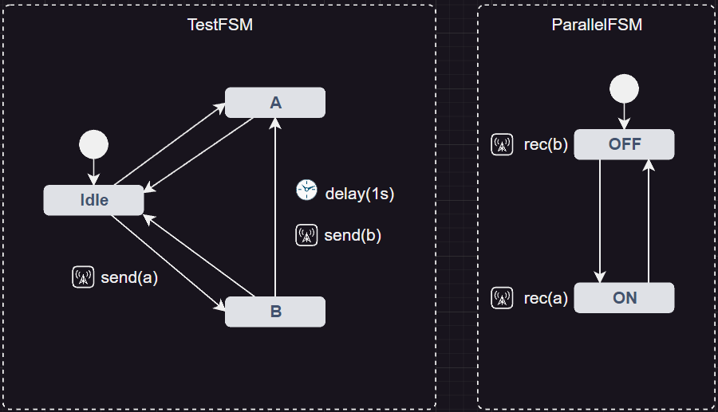

# NbSimpleFSM-Godot

_Yet another simple FSM for Godot 4.x. This FSM is heavily inspired by [godot-statecharts](https://github.com/derkork/godot-statecharts). Our goal was to keep the workflow but streamline it to our use cases._

> :warning: This repository is in a very early expiremental stage.

## Features
This FSM implementations offers advanced functionalities like parallelism, broadcasting and delays. Many error checks that can occur during the development process are deliberately omitted in order to be more performant.

## Example
In the following example two state machines are utilized. While the TestFSM is utilized by the user, the second is under the controll of the first FSM. The transformation from Idle to B will also trigger the broadcast event (a). The tranformation from B to A has a delay of 1s and will broadcast event (b). Both broadcast events are used to switch the states of the ParallelFSM.

